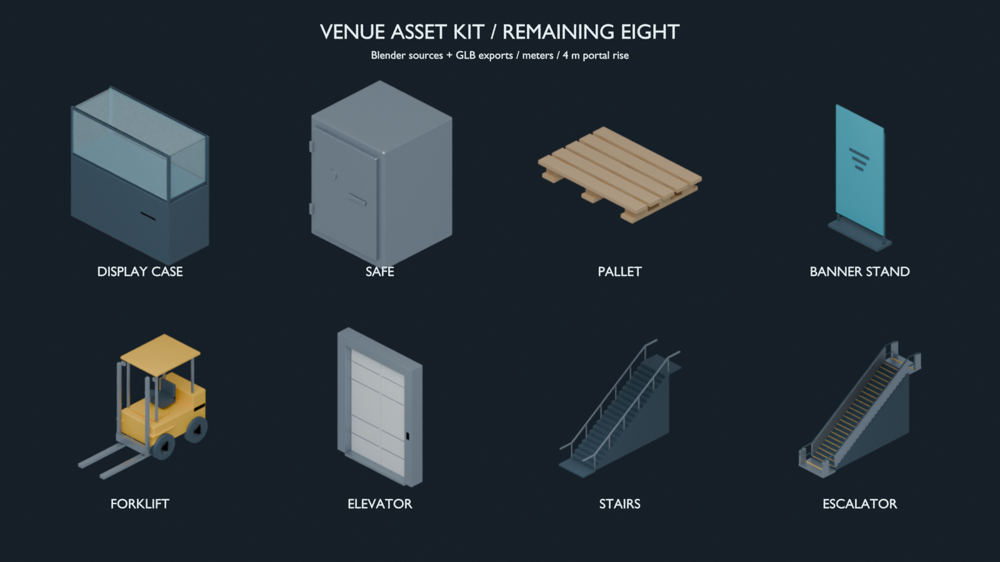

# Remaining eight assets — production report

Date: 2026-10-02. Scope: produce the eight requested assets now; continue website work later. Authoring: Blender 4.5.9 LTS, generator 1.1.0. Export release: v1, plain glTF binary, meters, Y-up, +Z front.

## Delivered assets

All eight include editable Blender sources, reproducible recipes, versioned GLBs and metadata, and front/side/top/hero previews. Dimensions below are measured exported width × height × depth; triangle and material counts come from the actual GLBs.

| Asset             | Dimensions (m)   | Triangles | Materials | GLB bytes | Source                                                                                    |
| ----------------- | ---------------- | --------: | --------: | --------: | ----------------------------------------------------------------------------------------- |
| Display case      | 1.2 × 1.1 × 0.5  |       200 |         2 |    24,900 | [Blender source](../../assets-source/blender/display-case/display-case.blend)             |
| Safe              | 0.6 × 0.8 × 0.6  |       264 |         1 |    23,588 | [Blender source](../../assets-source/blender/safe/safe.blend)                             |
| Pallet            | 1.2 × 0.15 × 0.8 |       204 |         1 |    26,380 | [Blender source](../../assets-source/blender/pallet/pallet.blend)                         |
| Banner stand      | 1 × 2 × 0.3      |        86 |         2 |    12,472 | [Blender source](../../assets-source/blender/banner-stand/banner-stand.blend)             |
| Forklift          | 1.2 × 2.2 × 3    |     1,124 |         3 |    86,792 | [Blender source](../../assets-source/blender/forklift/forklift.blend)                     |
| Elevator entrance | 2 × 2.65 × 0.3   |       352 |         3 |    37,084 | [Blender source](../../assets-source/blender/elevator-entrance/elevator-entrance.blend)   |
| Stairs            | 2 × 5.155 × 8    |       480 |         2 |    60,716 | [Blender source](../../assets-source/blender/stairs/stairs.blend)                         |
| Escalator         | 2 × 5.150274 × 8 |     1,608 |         3 |   106,940 | [Blender source](../../assets-source/blender/escalator-entrance/escalator-entrance.blend) |

The escalator release ID is `escalator-entrance`. Its model includes static steps, comb plates, steel side panels, yellow safety nosings, and continuous rounded handrails. The forklift includes a body, mast, carriage, forks, wheels, seat, protective roof, and cab supports. All finishes use scalar PBR values; no external textures or decoder downloads are required.

## Quality variants

Each variant has its own editable source, recipe, GLB, metadata, and four previews. Variants preserve bounds within 0.005 m and have identical sockets, footprint, collider metadata, required nodes, anchor, and facing.

| Asset             | Variant                    | Triangles | Percentage of baseline | GLB bytes |
| ----------------- | -------------------------- | --------: | ---------------------: | --------: |
| Display case      | Opaque glass approximation |       200 |                   100% |    24,868 |
| Forklift          | Low detail                 |       268 |                  23.8% |    28,432 |
| Elevator entrance | Low detail                 |        84 |                  23.9% |    11,724 |
| Stairs            | Low detail                 |       152 |                  31.7% |    20,468 |
| Escalator         | Low detail                 |       480 |                  29.9% |    26,432 |

The opaque display case changes material transparency while retaining geometry. Portal low-detail variants use a simple inclined surface instead of individual treads. All four low-detail variants satisfy the at-most-half-baseline triangle requirement.

## Placement and attachment interfaces

- Display case and safe have front interaction sockets; forklift has a service socket and a footprint that includes its protruding forks.
- Banner `branding_surface` has an exported full-rectangle UV map. Its 0.95 × 1.8 m attachment rectangle faces +Z; `socket_branding` and replaceable `branding_default_0/1/2` nodes are declared in metadata. Square and wide placeholder previews demonstrate the authoring dimensions; browser logo replacement remains pending.
- Elevator exports separately named `door_left` and `door_right` meshes with child trim details. Source and release poses are closed. A separate native preview shows both doors open; runtime animation remains pending.
- Stairs and escalator share lower `[0, 0, 0]` and upper `[0, 4, -7]` landing-center sockets. Their 4 m rise is separate from total model height, which includes handrails and landing thickness. A 6 m flight plus two 1 m landings gives an 8 m complete depth.
- Portal roots represent the entry plane, rather than the lowest geometry vertex. Threshold slabs extend below that plane. The schema and inspector now check the entry socket as the anchor, allowing these physical slabs.
- Stairs and escalator declare three primitive collision proxies: lower landing, upper landing, and inclined ramp. Collision-only geometry is excluded from exports. These proxies do not establish working traversal or building cutouts.

## Validation evidence

- [Actual GLB inspection](catalog-validation.json): all 18 baseline/quality exports in the complete catalog passed structural glTF validation and metadata, budgets, bounds, root transform, required node, socket, material, source-link, and texture checks. This includes the existing five and the 13 new releases. No GLB inspection errors were recorded.
- [Native source inspection](source-validation.json): all 13 new `.blend` files reopened successfully in isolated Blender processes and passed mesh validity, meter units, neutral root, identity/version, geometry bounds, source/export triangle count, and socket checks.
- 55 new authoring previews: four per new release, an additional elevator door-open view, and two banner aspect previews. The overview scene is saved as `assets-source/blender/asset-sheet.blend` with packed preview images.
- Rebuilt the pallet from the current recipe and republished only after validating the generated candidate catalog. Candidate catalog generation does not update the released catalog; `bun run assets:validate --publish` performs that step after inspection succeeds.

Final scoped checks passed: `bun run typecheck`, `bunx oxlint scripts/assets/validate.ts src/frontend/entities/asset/model/asset-schema.ts`, formatting checks for the changed asset contract/validator/metadata/reports/checklist, `bun run assets:validate`, and `bunx @fission-ai/openspec@1.3.1 validate blender-asset-pipeline --strict`. The validator script is excluded by the repository's normal formatter configuration, so it was also formatted and checked with an equivalent temporary configuration that includes scripts. Rebuild and native inspection commands are in the source [README](../../assets-source/blender/README.md). No unit tests were added or run for this request. The broader website acceptance gates remain open.

## Deferred work

Website imports and rendering for these eight, calibrated placement, portal transit, logistics anchors, logo upload/replacement, glass appearance under website lighting, batching/cache ownership, stress/performance acceptance, and production browser delivery remain pending. The full OpenSpec change is still active. No deployment, commit, or push is part of this delivery.

OpenSpec tasks 6.1–6.5, 7.1–7.3, and 8.2 have production evidence. Tasks 6.6 and 6.7 retain the deferred browser requirements for glass and branding.
